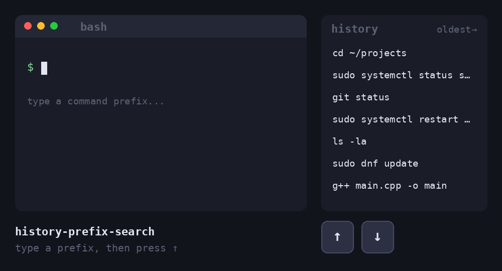

# history-prefix-search

**Prepare with AI**

**I found the idea from someone repo. I didn't find him to give credit. If U know, let me know the repo. I will Definitely give him credit.**



Type the beginning of a command, press **Up**, and cycle through only the history entries that start with what you typed.

```
$ su<Up>          ->  sudo dnf update
$ su<Up><Up>      ->  sudo systemctl restart NetworkManager
$ su<Down>        ->  back toward newer matches
```

With nothing typed, Up and Down behave normally. Works in **bash** and **zsh**.

## Install

```bash
git clone https://github.com/ChemistCoder90/Shell-HistUp.git
./install.sh            # auto-detects bash and zsh
```

Options:

| Command | Effect |
|---|---|
| `./install.sh` | Installs for every shell found (bash / zsh) |
| `./install.sh --bash` | bash only |
| `./install.sh --zsh` | zsh only |
| `./install.sh --all` | both, even if a shell is not installed |

Then **open a new terminal**. Running the installer twice is safe; it will not duplicate anything.

## Uninstall

```bash
./uninstall.sh
```

Open a new terminal afterwards. The uninstaller removes only the block this project added.

## How it works

The installer appends a clearly marked block to your config file:

```
# >>> history-prefix-search >>>
...
# <<< history-prefix-search <<<
```

| Shell | File edited | Mechanism |
|---|---|---|
| bash | `~/.inputrc` | Binds the arrow keys to readline's `history-search-backward` / `history-search-forward`. Wrapped in `$if Bash` so only bash is affected. |
| zsh | `~/.zshrc` | Binds the arrow keys to `up-line-or-beginning-search` / `down-line-or-beginning-search`. |

Each arrow key is bound under several key codes (`\e[A` and `\eOA`, plus terminfo for zsh) because terminals send different codes for Up/Down depending on their mode.

If the file already had content, a backup is saved as `<file>.hps.bak` before the first change.

## Manual setup (no scripts)

**bash**: add to `~/.inputrc`:

```
"\e[A": history-search-backward
"\e[B": history-search-forward
"\eOA": history-search-backward
"\eOB": history-search-forward
```

**zsh**: add to `~/.zshrc`:

```zsh
autoload -U up-line-or-beginning-search down-line-or-beginning-search
zle -N up-line-or-beginning-search
zle -N down-line-or-beginning-search
bindkey '^[[A' up-line-or-beginning-search
bindkey '^[[B' down-line-or-beginning-search
```

## Troubleshooting

- **Nothing changes**: you must open a new terminal (or run `bind -f ~/.inputrc` in bash, `source ~/.zshrc` in zsh).
- **Recent commands missing in bash**: bash saves history only when a terminal closes. Add this to `~/.bashrc` to save after every command:
  ```bash
  PROMPT_COMMAND='history -a'
  ```
- **Up key still ignores the prefix**: your terminal may send a different key code. Press `Ctrl+V` then `Up` to see it (for example `^[[A`), and bind that sequence the same way.
- **tmux**: also works, but make sure `TERM` is `screen` or `tmux-256color`.

## Extras

`extras/hist.cpp` is a small C++ program that prints history commands starting with a prefix (newest first, duplicates removed):

```bash
g++ -O2 -std=c++17 -o hist extras/hist.cpp
./hist su                          # reads ~/.bash_history
./hist su ~/.zsh_history           # or pick another file
```

## Tests

```bash
./test.sh
```

Runs install, a repeated install, and uninstall inside a temporary `HOME`, so your real config is never touched.

## License

MIT
